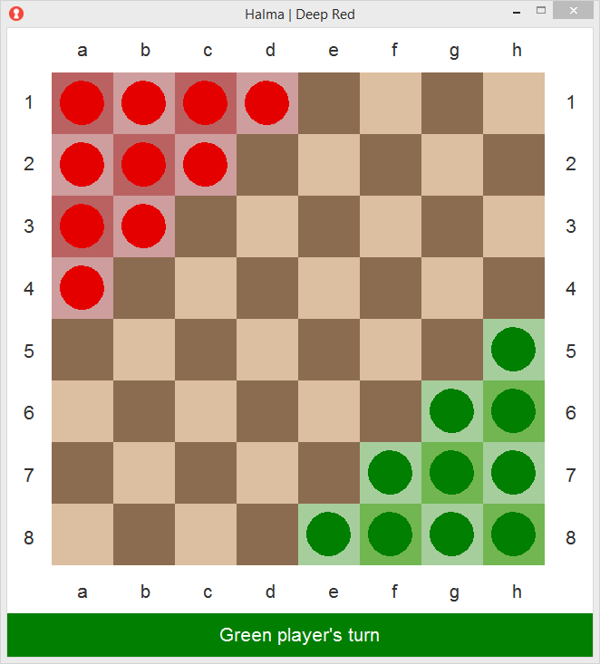
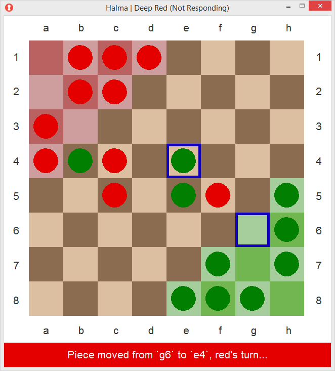
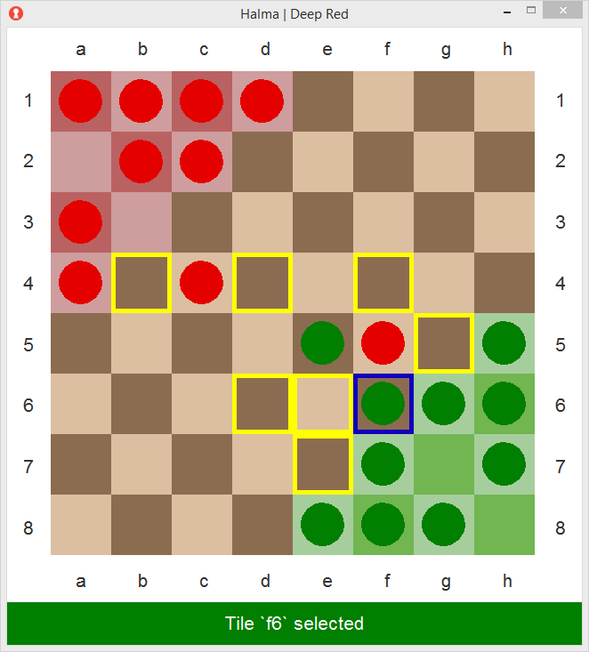

#  Halma AI - Project for FEUP MECD - IART Table

An AI that uses an adversarial minimax search with alpha-beta purning to
determine the best subsequent move. The program also supports player vs.
player games.

`usage: halma <b-size> <t-limit> [<h-player>]`

## Game Images

    
    
    

## AI Project
Topic 2: Adversarial Search Methods for Two-Player Board Games
A board game is characterized by the type of board and tiles, the rules of movement of the pieces
(operators/possible moves) and the finishing conditions of the game with the respective score. In this work,
the aim is to implement a game for two players and solve different versions of this game, using the Minimax
search method with α cuts and its variants.
Human-human, human-computer and computer-computer game modes should be developed, where the
computer should exhibit different skills (levels of difficulty). Computer performance should be compared
regarding the different skills (e.g., hard, medium, easy), corresponding to different evaluation functions,
different depth levels of Minimax, different successor generation ordering and/or variants of the Minimax
algorithm. The work may also include a Monte Carlo Tree Algorithm and its comparison with Minimax.
Emphasis should be placed on the analysis of the results of the computer players (wins, draws, losses, and
other quality parameters, such as the number of plays to obtain the win/loss) and average time spent to
obtain the solutions/plays.
The application to be developed must have a proper user interface in text or graphic mode, to show the
evolution of the board and interact with the user / player. You must allow the game modes indicated above, 
allowing the selection of the game mode, type of each player, and skills of computer players. You should
allow different skilled computer players to play with each other. You may also consider providing human
players with movement “hints”. 

## Additional Notes

* The move-finding method is under the assumption that pieces cannot re-enter
friendly goals or leave enemy goals even during a jump chain.
* Computation is currently fixed to a ply-depth of 3 rather than using
dynamic depth.
* Turn time exhaustion will simply break the recursion with its current max.

## Team Info

* Ian Karkles - up202200596@edu.fe.up.pt
* Diogo Cruz - up202202464@edu.fe.up.pt
